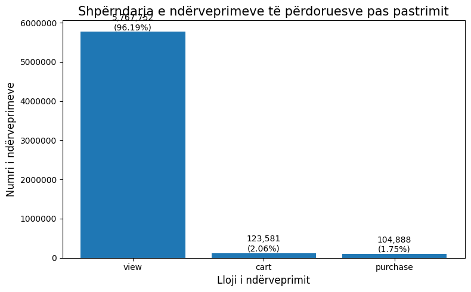
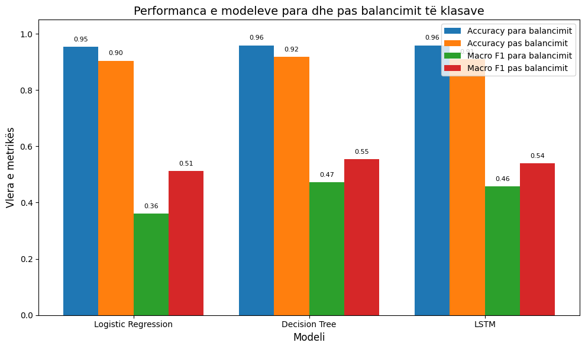
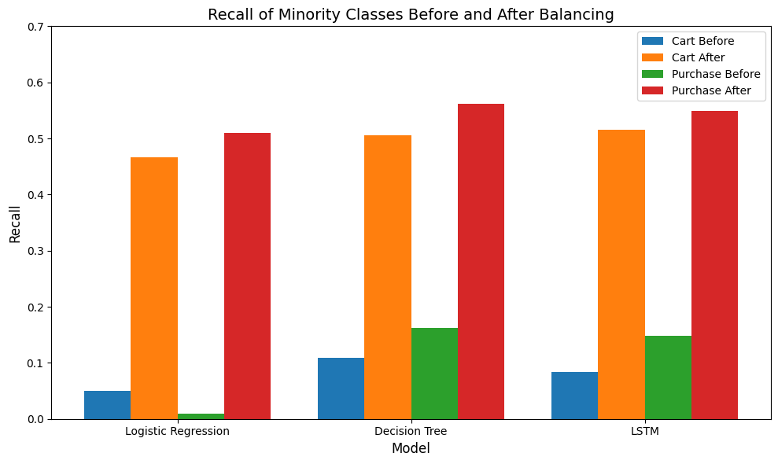

# Parashikimi i sjelljes së përdoruesve duke përdorur RNN

## Përmbledhje e projektit

Ky projekt fokusohet në parashikimin e ndërveprimit të ardhshëm të përdoruesit në një mjedis të tregtisë elektronike, duke përdorur të dhëna sekuenciale mbi sjelljen e përdoruesve.

Modeli kryesor i përdorur në projekt është rrjeti nervor Long Short-Term Memory (LSTM), i cili është projektuar për të mësuar modele nga sekuencat e ndërveprimeve të përdoruesve. Për krahasim janë implementuar edhe dy modele tradicionale të mësimit makinerik, Logistic Regression dhe Decision Tree, të cilat përdoren si modele bazë.

Detyra e parashikimit konsiston në parashikimin e ndërveprimit të ardhshëm të përdoruesit si një nga tri llojet e ngjarjeve:

- `view`
- `cart`
- `purchase`

Implementimi është realizuar në një Jupyter Notebook duke përdorur Python, si dhe biblioteka për mësimin makinerik dhe mësimin e thellë.

## Qëllimi

Qëllimi kryesor i këtij projekti është të hulumtojë nëse ndërveprimet e mëparshme të përdoruesit brenda një sesioni mund të përdoren për të parashikuar veprimin e tij të ardhshëm.

Projekti gjithashtu analizon ndikimin e pabalancimit të klasave në performancën e modeleve, duke krahasuar rezultatet para dhe pas aplikimit të metodës Random UnderSampling në të dhënat e trajnimit.

## Të dhënat

Projekti përdor dataset-in **E-Commerce Behavior Data from Multi-Category Store**.

Eksperimenti përdor skedarin `2019-Oct.csv`. Meqenëse dataset-i origjinal i muajit tetor përmban më shumë se 42 milionë regjistrime, në notebook përpunohen **6,000,000 regjistrime**, duke përdorur pjesë prej **500,000 regjistrimesh**.

Dataset-i përmban informacione mbi ndërveprimet e përdoruesve, duke përfshirë:

- kohën e ngjarjes
- llojin e ngjarjes
- ID-në e produktit
- ID-në e kategorisë
- kodin e kategorisë
- markën
- çmimin
- ID-në e përdoruesit
- sesionin e përdoruesit

Llojet kryesore të ngjarjeve të përdorura për parashikim janë:

- `view`
- `cart`
- `purchase`

Dataset-i origjinal nuk është përfshirë në repository për shkak të madhësisë së tij.

## Teknologjitë dhe bibliotekat

Projekti është implementuar duke përdorur:

- Python
- Jupyter Notebook
- NumPy
- Pandas
- Matplotlib
- Seaborn
- Scikit-learn
- Imbalanced-learn
- TensorFlow / Keras

## Modelet e mësimit makinerik

Në projekt janë implementuar dhe krahasuar tri modele klasifikimi.

### Logistic Regression

Logistic Regression është përdorur si një model tradicional bazë i Machine Learning për parashikimin e ndërveprimit të ardhshëm të përdoruesit.

### Decision Tree

Decision Tree është përdorur si model i dytë bazë për klasifikimin e ndërveprimit të ardhshëm të përdoruesit.

### LSTM

Long Short-Term Memory (LSTM) është modeli kryesor i Deep Learning i përdorur në projekt.

Modeli përdor sekuenca të **pesë ndërveprimeve të mëparshme të përdoruesit** për të parashikuar ndërveprimin pasues.

## Hapat kryesorë

Rrjedha kryesore e projektit është:

1. Ngarkimi i 6,000,000 regjistrimeve nga dataset-i i tetorit 2019 duke përdorur pjesë të të dhënave.
2. Kryerja e analizës eksploruese të të dhënave.
3. Kontrollimi i regjistrimeve të dyfishta dhe vlerave që mungojnë.
4. Heqja e regjistrimeve të dyfishta dhe trajtimi i vlerave që mungojnë në kolonat kategorike.
5. Konvertimi i vlerave të kohës dhe organizimi i ngjarjeve në mënyrë kronologjike brenda sesioneve të përdoruesve.
6. Kodimi i llojeve të ngjarjeve:
   - `view = 0`
   - `cart = 1`
   - `purchase = 2`
7. Krijimi i sekuencave me pesë ngjarje për të parashikuar ngjarjen pasuese.
8. Renditja kronologjike e sekuencave të krijuara.
9. Ndarja e të dhënave në grupe trajnimi dhe testimi duke përdorur ndarje kronologjike 80/20.
10. Trajnimi i modeleve Logistic Regression, Decision Tree dhe LSTM.
11. Vlerësimi i modeleve duke përdorur Accuracy, Precision, Recall, F1-Score, Macro F1-Score dhe matricat e konfuzionit.
12. Aplikimi i Random UnderSampling për balancimin e të dhënave të trajnimit.
13. Ritrajnimi i modeleve duke përdorur të dhënat e balancuara.
14. Krahasimi i performancës së modeleve para dhe pas balancimit të klasave.

## Rezultatet

Dataset-i është shumë i pabalancuar, ku klasa `view` përfaqëson shumicën e ndërveprimeve të përdoruesve.

Para balancimit, modelet arrijnë saktësi të lartë të përgjithshme, por klasat më pak të përfaqësuara (`cart` dhe `purchase`) janë më të vështira për t'u parashikuar.

Pas aplikimit të Random UnderSampling në të dhënat e trajnimit, Accuracy e përgjithshme zvogëlohet, ndërsa performanca në identifikimin e klasave më pak të përfaqësuara përmirësohet, gjë që reflektohet në rritjen e Macro F1 dhe Recall për klasat cart dhe purchase.

### Krahasimi i modeleve

| Modeli | Accuracy para balancimit | Accuracy pas balancimit | Macro F1 para | Macro F1 pas |
|---|---:|---:|---:|---:|
| Logistic Regression | 0.9541 | 0.9043 | 0.3614 | 0.5122 |
| Decision Tree | 0.9590 | 0.9176 | 0.4728 | 0.5540 |
| LSTM | 0.9591 | 0.9093 | 0.4728 | 0.5304 |

Rezultatet tregojnë se balancimi i klasave e zvogëlon saktësinë e përgjithshme, por përmirëson aftësinë e modeleve për të identifikuar ndërveprimet më pak të shpeshta `cart` dhe `purchase`.

Bazuar në Macro F1, Decision Tree paraqet performancën më të lartë pas balancimit, i ndjekur nga LSTM dhe Logistic Regression.

### Recall i klasave më pak të përfaqësuara

Për modelin LSTM, Recall-i i klasave më pak të përfaqësuara përmirësohet pas balancimit:

| Ngjarja | Para balancimit | Pas balancimit |
|---|---:|---:|
| `cart` | 0.08 | 0.53 |
| `purchase` | 0.15 | 0.52 |

Këto rezultate tregojnë se Random UnderSampling përmirëson identifikimin e ndërveprimeve më pak të shpeshta `cart` dhe `purchase`, megjithëse ky përmirësim shoqërohet me një ulje të saktësisë së përgjithshme.

## Pamje vizuale të rezultateve

Repository mund të përmbajë figura të përzgjedhura të gjeneruara gjatë eksperimenteve.

### Shpërndarja e ngjarjeve pas përpunimit të të dhënave



### Krahasimi i modeleve para dhe pas balancimit



### Recall i klasave më pak të përfaqësuara



## Si të ekzekutohet projekti

Implementimi i plotë është i disponueshëm në Jupyter Notebook:

**[Hap Jupyter Notebook](./user_behavior_prediction_lstm.ipynb)**

### Përdorimi në Kaggle

Notebook-u mund të ekzekutohet në një mjedis Kaggle.

1. Hapni notebook-un e projektit.
2. Shtoni dataset-in **E-Commerce Behavior Data from Multi-Category Store**.
3. Sigurohuni që skedari `2019-Oct.csv` të jetë i disponueshëm.
4. Ekzekutoni qelizat e notebook-ut nga fillimi deri në fund.

### Përdorimi lokalisht me Jupyter Notebook

Klononi repository-n:

```bash
git clone <repository-url>
cd user-behavior-prediction-lstm
